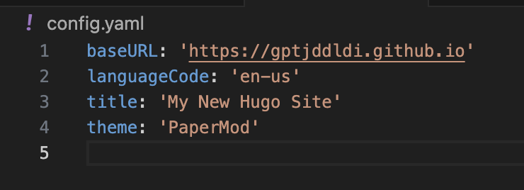
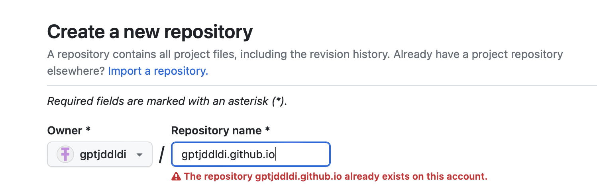
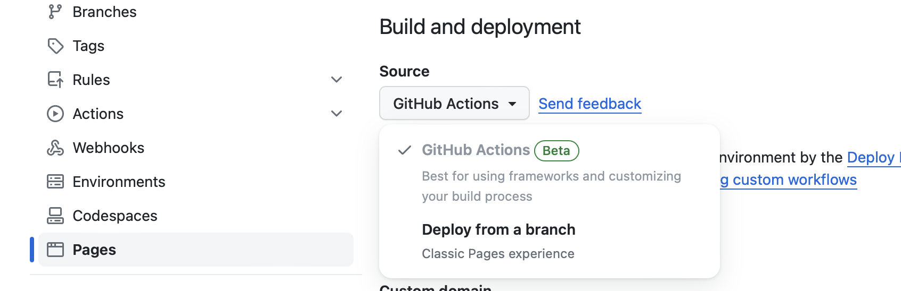
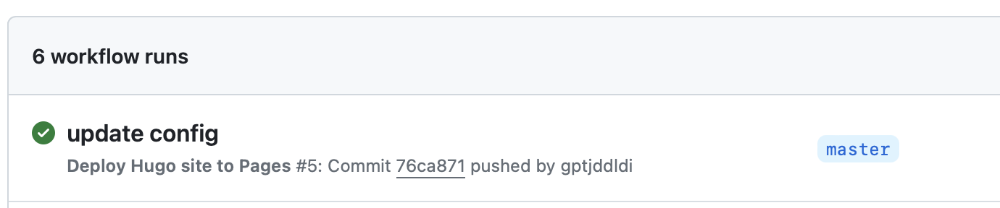

### 머릿말
Hugo 로 Github page 에 Static Site 를 배포해 보자.

---

### 1. Hugo 설치
mac 사용자는 brew 로 설치할 수 있다.
```
brew install hugo
```

### 2. Hugo 프로젝트 생성
```
hugo new site ${github 계정 이름.github.io} -f yaml
cd ${깃헙이름.github.io}
git init
```
개인 취향으로 config 파일을 yaml 확장자로 설정했다.

```-f yaml``` 설정 없이 생성 시 toml 이 기본 확장자이다.

### 3. Hugo 테마 설정

Hugo 프로젝트를 생성하고 테마를 설정해야 한다.
나는 개인 취향으로 [hugo-PaperMod](https://github.com/adityatelange/hugo-PaperMod)로 결정했다.

([Hugo Themes](https://themes.gohugo.io) 에서 더 많은 테마 참고)

```
git submodule add --depth=1 https://github.com/adityatelange/hugo-PaperMod.git themes/PaperMod
git submodule update --init --recursive
```

```
git submodule update --remote --merge
```

config.yaml 파일에 ```theme: 'PaperMod'``` 추가한다.


마지막으로 아래 명령어로 휴고 프로젝트에 새로운 모듈이 들어왔다고 알려준다.
```
hugo mod get -u
```
#### 4. 실행해 보기
```
hugo server
```
실행하면 Hugo 로 생성된 정적 사이트에 [이 주소](http://localhost:1313)로 접근할 수 있다.


### 5. Github Repository 생성



Hugo site 를 만들 때 썼던 폴더 이름으로 repository 를 만든다. ```github 계정 이름.github.io```

만든 Reposiotry 의 Settings - Pages - Build and deployment - Source 경로에 들어가서 ```Deploy from a branch``` 에서 ```Github Actions``` 로 변경한다.


프로젝트 폴더로 돌아가 git 과 폴더를 연동하자.

```
git init
git branch -M master
git remote add origin https://github.com/${github 계정 이름}/${github 계정 이름}.github.io.git
git add .
git commit -m "initial commit"
git push -u origin/master
```

### 6. Github 과 Hugo 연동

아래 경로로 파일을 생성한 뒤 내용을 복붙하여 저장한 뒤 푸쉬한다.
```.github/workflows/hugo.yaml```
```
# Sample workflow for building and deploying a Hugo site to GitHub Pages
name: Deploy Hugo site to Pages

on:
  # Runs on pushes targeting the default branch
  push:
    branches:
      - master

  # Allows you to run this workflow manually from the Actions tab
  workflow_dispatch:

# Sets permissions of the GITHUB_TOKEN to allow deployment to GitHub Pages
permissions:
  contents: read
  pages: write
  id-token: write

# Allow only one concurrent deployment, skipping runs queued between the run in-progress and latest queued.
# However, do NOT cancel in-progress runs as we want to allow these production deployments to complete.
concurrency:
  group: "pages"
  cancel-in-progress: false

# Default to bash
defaults:
  run:
    shell: bash

jobs:
  # Build job
  build:
    runs-on: ubuntu-latest
    env:
      HUGO_VERSION: 0.120.2
    steps:
      - name: Install Hugo CLI
        run: |
          wget -O ${{ runner.temp }}/hugo.deb https://github.com/gohugoio/hugo/releases/download/v${HUGO_VERSION}/hugo_extended_${HUGO_VERSION}_linux-amd64.deb \
          && sudo dpkg -i ${{ runner.temp }}/hugo.deb          
      - name: Install Dart Sass
        run: sudo snap install dart-sass
      - name: Checkout
        uses: actions/checkout@v4
        with:
          submodules: recursive
          fetch-depth: 0
      - name: Setup Pages
        id: pages
        uses: actions/configure-pages@v3
      - name: Install Node.js dependencies
        run: "[[ -f package-lock.json || -f npm-shrinkwrap.json ]] && npm ci || true"
      - name: Build with Hugo
        env:
          # For maximum backward compatibility with Hugo modules
          HUGO_ENVIRONMENT: production
          HUGO_ENV: production
        run: |
          hugo \
            --gc \
            --minify \
            --baseURL "${{ steps.pages.outputs.base_url }}/"          
      - name: Upload artifact
        uses: actions/upload-pages-artifact@v2
        with:
          path: ./public

  # Deployment job
  deploy:
    environment:
      name: github-pages
      url: ${{ steps.deployment.outputs.page_url }}
    runs-on: ubuntu-latest
    needs: build
    steps:
      - name: Deploy to GitHub Pages
        id: deployment
        uses: actions/deploy-pages@v2
```

github 의 Actions 탭을 보면 사진처럼 커밋이 푸쉬될 때 마다 자동으로 사이트를 빌드하고 배포가 진행되는 걸 확인할 수 있다.




### 7. 확인하기
이렇게 생성된 정적 사이트는
https://${github 계정 이름}.github.io 주소에서 확인할 수 있다.


---
### Reference 📚
- https://gohugo.io/getting-started/quick-start/
- https://github.com/adityatelange/hugo-PaperMod/wiki/Installation
- https://gohugo.io/hosting-and-deployment/hosting-on-github/